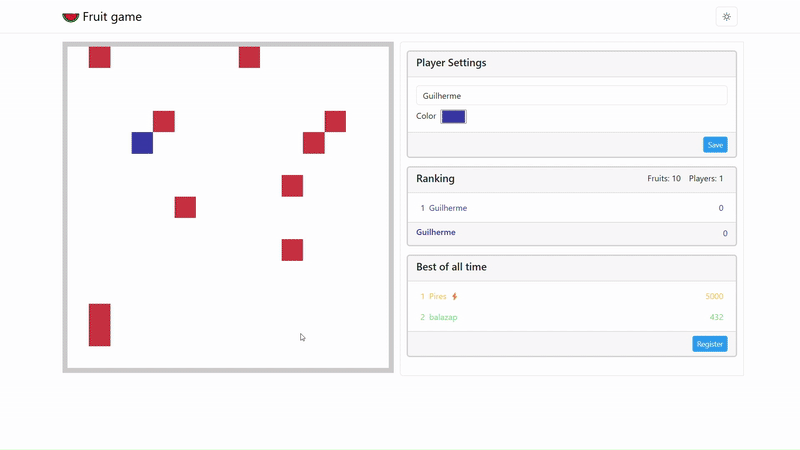

## Índice 📑

- [Sobre Fruit Game](#fruit-game)
- [Onde e Como Jogar 🎮](#onde-e-como-jogar-)
  - [Objetivo do Jogo](#objetivo-do-jogo)
  - [Como Jogar](#como-jogar)
- [Ferramentas 🔧](#ferramentas-)
- [Como funciona 📚](#como-funciona-)
- [Licença](#licença)

# Fruit Game
### Inspirado e criado pela playlist de [Filipe Deschamps](https://github.com/FilipeDeschamps) no projeto "Meu primeiro jogo multiplayer"

Acompanhando os vídeos da [playlist](https://www.youtube.com/watch?v=0sTfIZvjYJk&list=PLMdYygf53DP5SVQQrkKCVWDS0TwYLVitL) do Filipe no Youtube, pude fazer também este jogo 
adicionando alguns elementos a mais, que dão aquele diferencial para este projeto de estudo.\
**O jogo não possui nenhum fim lucrativo e está disponível publicamente para estudo!**

## Onde e Como Jogar 🎮

Basta [clicar aqui](https://fruit-game-zsci.onrender.com/) para jogar! 🚀

### Objetivo do Jogo
O objetivo do jogo é coletar a maior quantidade de fruitinhas que puder, enquanto compete com outros jogadores para ver quem pega mais!
Você pode acompanhar o ranking dos jogadores com a maior quantidade de frutinhas coletadas no momento. Também existe um ranking para os melhores jogadores que registraram seu recorde!

### Como Jogar
Basta precissionar as teclas de setas para se movimentar!\
🟦⬆️🟦\
⬅️⬇️➡️

Se você estiver jogando pelo celular, não se preocupe, na tela abaixo da arena há teclas na tela para interagir.

> [!NOTE]
> O jogo está hospedado no [Render](https://render.com/) de forma gratuita, então tenha paciência para abrir o jogo! 😁

## Ferramentas 🔧

- [HTML5](https://html.spec.whatwg.org/)
- [CSS3](https://developer.mozilla.org/en-US/docs/Web/CSS)
- [Bootstrap v5.3](https://getbootstrap.com/docs/5.3/getting-started/introduction/)
- [JavaScript](https://devdocs.io/javascript/)
- [Node](https://nodejs.org/docs/latest/api/)
- [Socket.io](https://socket.io/)

## Como funciona 📚
### Para os Devs ⚙️

O jogo possui um server usando Node.js com Express e Socket.io, para integrar em tempo real os jogadores de diferentes dispositivos.

Na pasta `public` temos o jogo dividido em 3 camadas:
- Regras de Negócio do Jogo `game.js`
- Entrada do Teclado `keyboard-listener.js`
- Renderização `render-screen.js`

Cada uma delas é integrada em `script.js`, do usuário, que emite e recebe as mudanças do servidor. 
Além disso é possível salvar o registro do ranking em um arquivo `JSON`, na pasta pública, através do servidor que recebe o comando do cliente.

## Licença

Este projeto está licenciado sob a Licença MIT - veja o arquivo LICENSE para mais detalhes.
